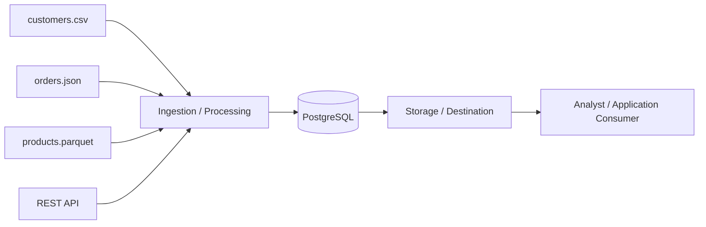

# Data Engineering Lifecycle Map

## Lifecycle Table

| Lifecycle Element | What It Means | Example in This Lab | Primary Tool/Artifact | Possible Failure |
|---|---|---|---|---|
| Source system | | | | |
| Ingestion/acquisition | | | | |
| Storage | | | | |
| Processing/transformation | | | | |
| Data quality/validation | | | | |
| Delivery | | | | |
| Consumer | | | | |

*Fill in every cell in your own words based on what you observed in this lab.*

## Flow Diagram

Replace the placeholder below with your own box-and-arrow diagram (a hand-drawn photo, a
draw.io export, or ASCII/Mermaid is fine, as long as it shows all required elements):

- CSV source
- JSON source
- Parquet source
- REST API
- PostgreSQL
- A pipeline/process box
- A storage/destination box
- A downstream analyst or application consumer

Example structure using Mermaid (renders on GitHub):

