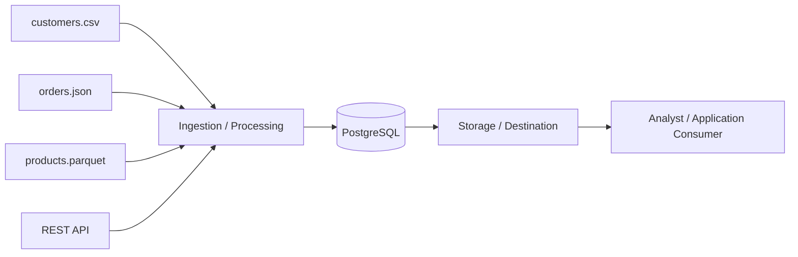

# Data Engineering Lifecycle Map

## Lifecycle Table

| Lifecycle Element | What It Means | Example in This Lab | Primary Tool/Artifact | Possible Failure |
|---|---|---|---|---|
| Source system | | | | |
| Ingestion/acquisition | Pulling raw data out of a source and into your own code/environment | Reading customers.csv, orders.json, products.parquet with pandas, and calling the REST API with requests | pandas, requests library | API is unreachable/times out, or a file is missing/moved |
| Storage | Where data lives after acquisition — either as raw files for archival/reference, or in a structured database once it's organized enough to query | Raw files (customers.csv, orders.json, products.parquet) sit in data/raw/; structured data lives in the PostgreSQL container (dss150p-postgres) | Docker (Postgres container), local filesystem (data/raw/) | Port conflicts (like you just hit), the database container not starting, or running out of disk space |
| Processing/transformation | Code that changes or reshapes raw data — cleaning, standardizing, engineering new fields — turning it into something ready for use | Not fully built yet in this lab, but sql/01_create_schema.sql defines the structure raw data would be transformed into before loading into Postgres | Python (pandas), SQL | Transformation logic has a bug and silently corrupts data, or a schema change breaks the transform step |
| Data quality/validation | Automated checks that catch problems before bad data moves further down the pipeline — nulls, duplicates, wrong types, out-of-range values | profile_sources.py checks null counts, duplicate rows, dtypes, and min/max ranges for each source | pandas (in profile_sources.py) | A real data-quality issue slips through because no check was written for it |
| Delivery | Getting cleaned, validated data from storage to wherever it's actually needed — a report, an app, a table someone can query | Not fully built in this lab, but would mean pushing data from Postgres into a dashboard, report, or downstream app | PostgreSQL, (would add: BI tool or API in a real pipeline) | Delivery job fails or is delayed, so consumers see stale data |
| Consumer | The person or system that actually uses the final data to make decisions or power something | A data analyst querying inventory_snapshot in Postgres, or an application reading from the database | SQL client (e.g. psql, pgAdmin), or a BI tool | Consumer misinterprets the data because of missing documentation, or queries an outdated table |

*Fill in every cell in your own words based on what you observed in this lab.*

## Flow Diagram

Replace the placeholder below with your own box-and-arrow diagram (a hand-drawn photo, a
draw.io export, or ASCII/Mermaid is fine, as long as it shows all required elements):

- CSV source
- JSON source
- Parquet source
- REST API
- PostgreSQL
- A pipeline/process box
- A storage/destination box
- A downstream analyst or application consumer

Example structure using Mermaid (renders on GitHub):

